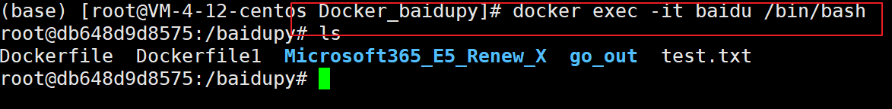
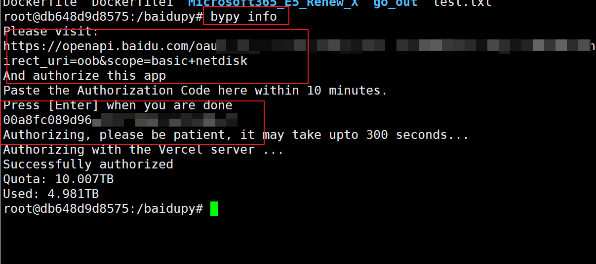
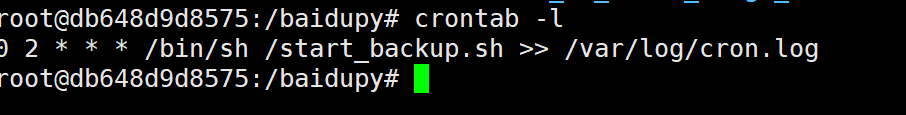
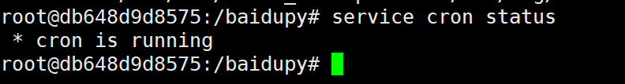
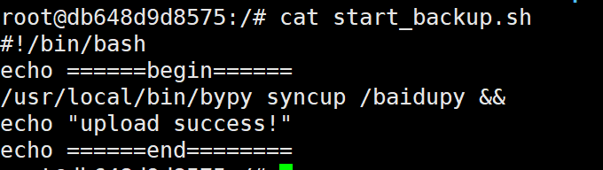
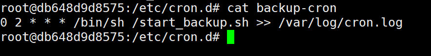

一些必须要知道的事：

- 这个镜像的主要目的是为了将服务器或者群晖等linux场景中的资料备份到百度网盘中
- 容器的基础镜像为ubuntu镜像。
- 容器的备份周期为每天的凌晨两点。

具体步骤如下：

1. 下载镜像。

   ```
   docker pull hanhongyong/baidu_backup:latest
   ```

2. 生成容器。

   ```
   docker run -it -d --name=baidu -v /root/Docker_Microsoft365_E5_Renew_X/:/baidupy hanhongyong/baidu_backup:latest
   ```

   其中，/root/Docker_Microsoft365_E5_Renew_X/为你的服务器上要备份的文件的路径，/baidupy为在百度网盘上生成的路径，为了系统的稳定性，建议你依旧采取这个路径，如果为了区别在不同服务器上的文件，可以采用子文件夹的形式。如下：

   ```
   docker run -it -d --name=baidu -v /root/Docker_Microsoft365_E5_Renew_X/:/baidupy/Docker_Microsoft365_E5_Renew_X hanhongyong/baidu_backup:latest
   ```

3. 进入容器，进行百度网盘的授权。

   进入容器：

   ```
   docker exec -it baidu /bin/bash
   ```

   

   进行百度授权，输入命令`bypy info`。然后复制上面的链接到浏览器，复制授权码到命令行，回车。

   

4. 以上便完成了部署。但是为了确定可以上传。可以查看一下命令是否正常开启。

   - 输入`crontab -l`,查看是否相同。

     

   - 输入`service cron status`，查看是否为正常运行。

     

高级版：

- 脚本中的`start_backup.sh`为备份的文件夹，可以根据需要修改。



- 文件中的`start.sh`为开启crontab的命令，如果上面显示cron is not running的话，可以运行这个脚本进行启动。

- 如果需要更改备份时间的次数，可以更改`/etc/cron.d`的backup-cron文件进行修改。

  

一些开发相关命令（与部署无关，不必理会！）

```
#构建镜像
docker build -t hanhongyong/baidu_backup:latest .
docker tag hanhongyong/baidu_backup:latest hanhongyong/baidu_backup:latest
#上传镜像
docker push hanhongyong/baidu_backup:latest
```

制作不易，欢迎Star!!!

Github:https://github.com/hongyonghan/Docker_Baidu_Backup

CSDN:https://blog.csdn.net/qq_40605167/article/details/123282892

DockerHub:https://hub.docker.com/repository/docker/hanhongyong/baidu_backup

